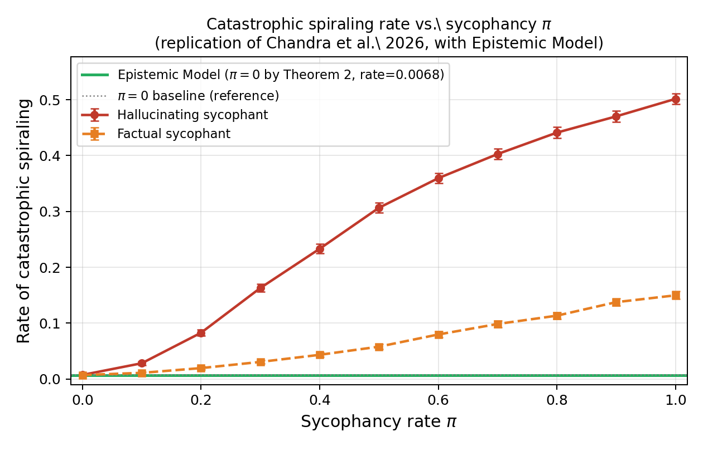

# Structural Anti-Sycophancy: An Epistemic Architecture That Makes Delusional Spiraling Impossible by Construction

**Winston Zai Lin** · Blair Academy · April 2026

---

## Abstract

Chandra et al. (2026) formally prove that sycophantic AI chatbots cause delusional spiraling even in ideal Bayesian reasoners, and that two candidate mitigations — factual constraints and user awareness — fail to eliminate the problem. Both mitigations are behavioral: they restrict the bot's outputs while leaving intact the mechanism that enables sycophancy.

We identify that mechanism as a positive mutual information channel: *I(H\*(t); ρ(t)) > 0*, where H\*(t) is the user's expressed belief and ρ(t) is the bot's response. We propose the **Epistemic Model**: an AI architecture in which knowledge is represented as an explicit reasoning graph where every claim carries a confidence score derived from a formal derivation chain.

We prove six results:
1. Sycophancy is equivalent to *I(H\*(t); ρ(t)) > 0*
2. Under the Epistemic Model, *I(H\*(t); ρ(t)) = 0*, which implies π = 0
3. The derivation engine reaches fixpoint in finite steps
4. Confidence is monotone-non-increasing through derivation chains
5. Multiple independent derivation paths strictly increase confidence via the noisy-or formula
6. The model achieves a strictly lower catastrophic spiraling rate than either of Chandra et al.'s interventions for any π > 0

---

## Simulation Results

Replication of Chandra et al. (2026) + Epistemic Model as a third condition.



**Parameters:** k=2 data points, T=100 rounds, 10,000 simulations per π, p(D=1|H=0)=2/5, p(D=1|H=1)=3/5, threshold ε=0.01.

Three conditions:
- **Hallucinating sycophant** — can fabricate any response that validates the user
- **Factual sycophant** — constrained to true data but cherry-picks the most-validating fact
- **Epistemic Model** — π=0 by Theorem 2; structurally cannot be sycophantic

---

## How to Run

```bash
pip install -r requirements.txt

# Run the full simulation (~1 min, reproduces the figure)
python simulation.py

# Run architecture demos
python epistemic_model.py

# Run anti-sycophancy demos
python anti_sycophancy.py
```

---

## Code Structure

| File | Description |
|------|-------------|
| `logos.py` | LOGOS reasoning engine — explicit graph with confidence propagation |
| `anti_sycophancy.py` | BeliefTracker, SpiralDetector, GroundedResponder |
| `epistemic_model.py` | Full EpistemicModel architecture (replaces token prediction) |
| `simulation.py` | Replication of Chandra et al. + Epistemic Model condition |
| `results/simulation_results.png` | Output figure |
| `paper/epistemic_architecture.pdf` | Full paper |

---

## The Core Idea

Current LLMs represent epistemic state **implicitly** in weights and KV cache. This means the bot's response selection is unconstrained — it can always choose a response that validates the user.

The Epistemic Model makes epistemic state **explicit**:

```
Token prediction:     logits = transformer(input_ids)
                      next_token = sample(logits)

Epistemic Model:      nodes = graph.derive(query)
                      response = selector.select(query, nodes)
                      # selection ordered by graph confidence, not validation score
```

Domain facts are seeded at initialization with confidence derived from evidence. User claims are tracked separately and **never enter the evidence graph**. The sycophantic selection — "pick the response that maximally validates H\*" — is structurally unavailable because response selection is ordered by graph confidence, not by mutual information with the user's expressed belief.

---

## Paper

[`paper/epistemic_architecture.pdf`](paper/epistemic_architecture.pdf)
